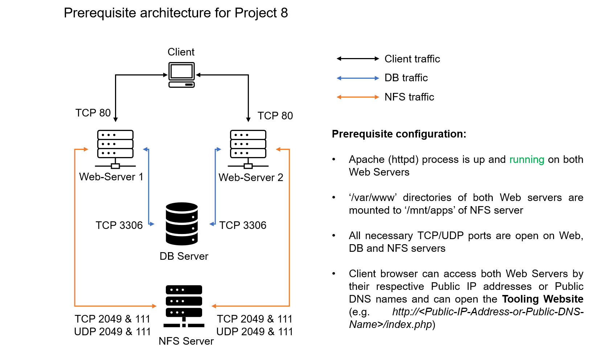
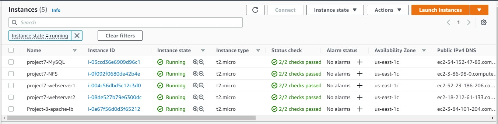
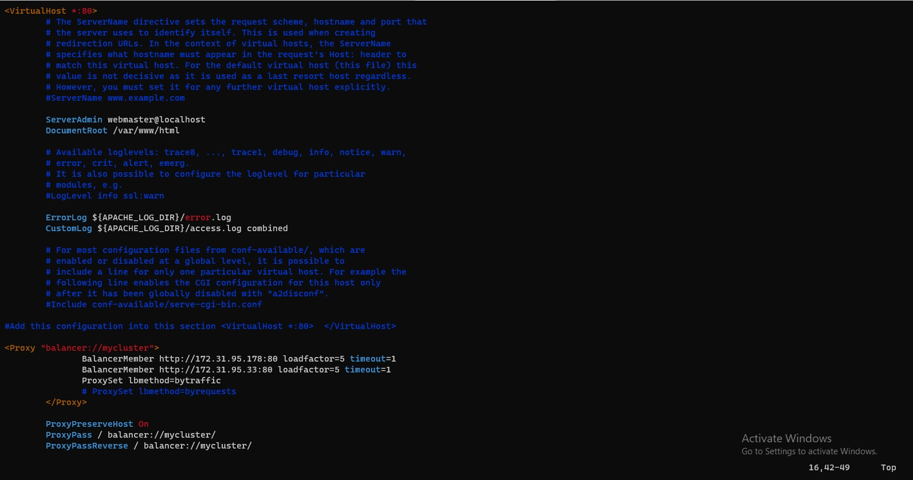
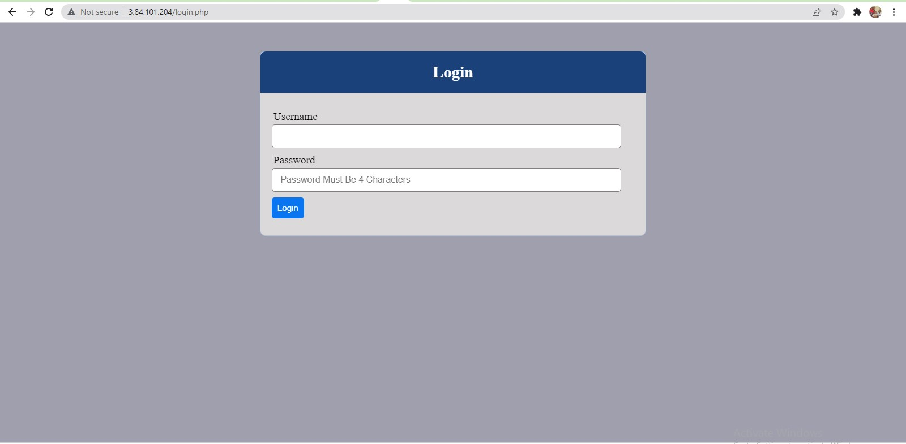

# **LOAD BALANCER SOLUTION WITH APACHE** ##

### **Task** ##
Deploy and configure an Apache Load Balancer for Tooling Website solution on a separate Ubuntu EC2 intance. Make sure that users can be served by Web servers through the Load Balancer.

We will implement this solution with 2 Web Servers, the approach will be the same for 3 and more Web Servers.

In our set up in Project-7 we had 3 Web Servers and each of them had its own public IP address and public DNS name. A client has to access them by using different URLs, which is not a nice user experience to remember addresses/names of even 3 server, let alone millions of Google servers.

In order to hide all this complexity and to have a single point of access with a single public IP address/name, a Load Balancer can be used. A Load Balancer (LB) distributes clients’ requests among underlying Web Servers and makes sure that the load is distributed in an optimal way.

From Project 7, 

Make sure that you have following servers installed and configured within Project-7:

Two RHEL8 Web Servers
One MySQL DB Server (based on Ubuntu 20.04)
One RHEL8 NFS server

1. Lunch an EC2 Ubuntu 20.04 Instance to be used as the **Apache Load Balancer**

So you should have these Instances running:

2. Open TCP port 80 on Project-8-apache-lb by creating an Inbound Rule in Security Group.
3. Install Apache Load Balancer on Project-8-apache-lb server and configure it to point traffic coming to LB to both Web Servers

~~~
sudo apt update
sudo apt install apache2 -y
sudo apt-get install libxml2-dev

#Enable following modules:
sudo a2enmod rewrite
sudo a2enmod proxy
sudo a2enmod proxy_balancer
sudo a2enmod proxy_http
sudo a2enmod headers
sudo a2enmod lbmethod_bytraffic
~~~
#Restart apache2 service
~~~
sudo systemctl restart apache2
~~~
Enable apache2 service to run when the server is restarted 
~~~
sudo systemctl enable apache2
~~~

Configure load balancing

~~~
sudo vi /etc/apache2/sites-available/000-default.conf
~~~

Restart apache
~~~
sudo systemctl restart apache2
~~~

Very the configuration by visiting the Public IP or NS name of the Load Balancer
~~~
http://<Load-Balancer-Public-IP-Address-or-Public-DNS-Name>/index.php
~~~

